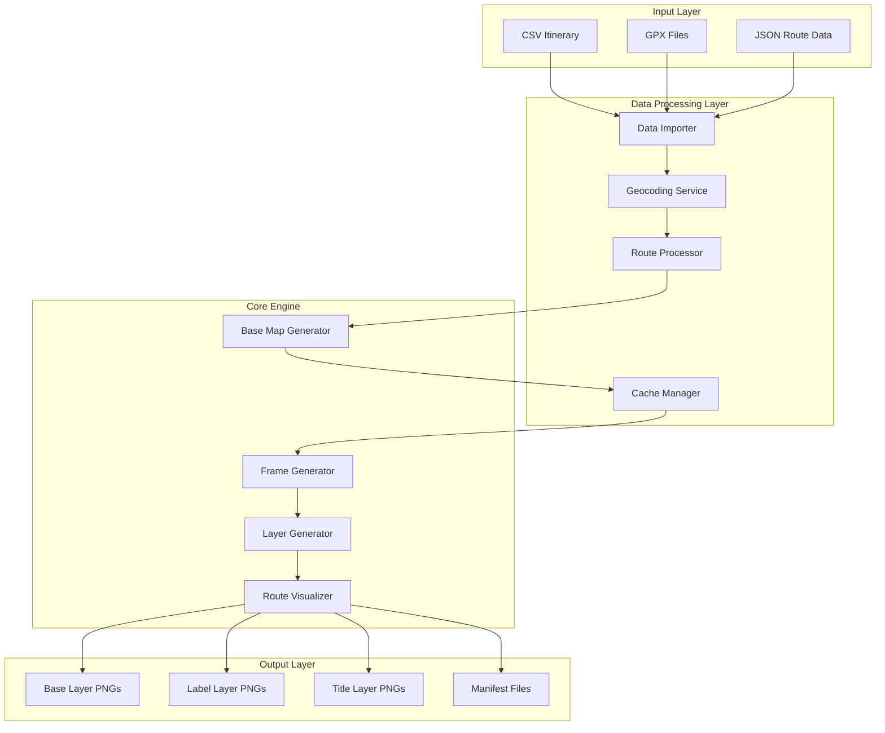
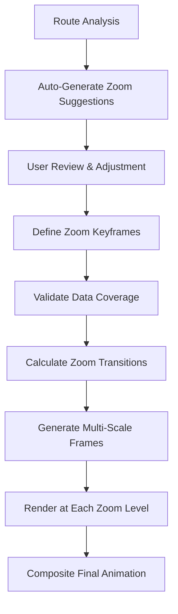
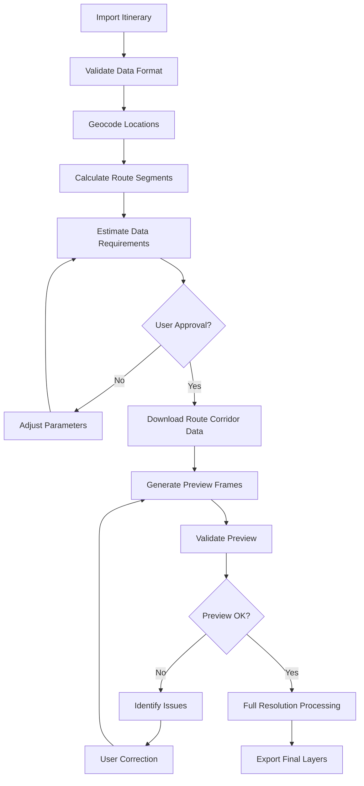

# Design Document: Road Trip Animator

## Overview

The Road Trip Animator extends the existing map poster system to create animated visualizations of road trips for video production. The system generates transparent PNG base maps and creates progressive animations showing trip routes with timestamps, designed specifically for video editing workflows.

The architecture builds upon the existing `create_map_poster.py` infrastructure, reusing the theme system, geographic data handling, and rendering pipeline while adding new capabilities for animation, routing, and layered output generation.

## Architecture

### High-Level Architecture



### Component Architecture

The system follows a modular architecture with clear separation of concerns:

1. **Data Processing Pipeline**: Handles input parsing, geocoding, and route calculation
2. **Geographic Engine**: Manages map data, caching, and base map generation
3. **Animation Engine**: Creates frame sequences and manages temporal progression
4. **Layer System**: Generates separate visual layers for flexible video production
5. **Export System**: Handles file output, naming, and metadata generation

## Components and Interfaces

### 1. Data Importer (`DataImporter`)

**Purpose**: Parse and validate input data from multiple formats

**Key Methods**:
- `import_csv_itinerary(file_path: str) -> RawItineraryData`
- `import_gpx_file(file_path: str) -> List[Waypoint]`
- `import_json_route(file_path: str) -> RouteData`
- `validate_data_format(data: Any) -> ValidationResult`

**Input Formats**:
- CSV with columns: Month, Date, Day, Week, State, Region, Location, Booking Notes, Accommodation
- GPX files with track points and timestamps
- JSON with structured waypoint arrays and optional route overrides

### 2. Geocoding Service (`GeocodingService`)

**Purpose**: Convert location names to coordinates with caching and error handling

**Key Methods**:
- `geocode_location(location: str, context: LocationContext) -> Coordinates`
- `batch_geocode(locations: List[str]) -> List[GeocodingResult]`
- `cache_result(location: str, coordinates: Coordinates) -> None`
- `get_failed_locations() -> List[FailedGeocoding]`

**Features**:
- Rate limiting with configurable delays
- Context-aware geocoding using State/Region information
- Local caching to avoid repeated API calls
- Batch processing for efficiency
- User agent: "road_trip_map_animator"

### 3. Route Processor (`RouteProcessor`)

**Purpose**: Calculate routes between waypoints using road networks

**Key Methods**:
- `calculate_route_segments(waypoints: List[Waypoint]) -> List[RouteSegment]`
- `apply_custom_routing(segment: RouteSegment, custom_path: List[Coordinates]) -> RouteSegment`
- `validate_route_connectivity(route: Route) -> ValidationResult`
- `calculate_distances(route: Route) -> DistanceMetrics`

**Routing Strategy**:
- Primary: OpenStreetMap routing for realistic road-following paths
- Fallback: Direct paths when routing data unavailable
- Override: Custom path specification for actual routes taken
- Validation: Ensure route segments connect properly

### 4. Cache Manager (`CacheManager`)

**Purpose**: Efficient storage and retrieval of geographic data

**Key Methods**:
- `cache_geographic_data(region: BoundingBox, data: GeographicData) -> None`
- `get_cached_data(region: BoundingBox) -> Optional[GeographicData]`
- `extract_subregion(parent_region: BoundingBox, target_region: BoundingBox) -> GeographicData`
- `manage_cache_size(max_size: int) -> None`

**Caching Strategy**:
- Hierarchical storage: Country → State → Region → City
- Spatial indexing for efficient region queries
- Compression for storage efficiency
- LRU eviction for size management
- Metadata tracking for cache hit analysis

### 5. Base Map Generator (`BaseMapGenerator`)

**Purpose**: Create transparent base maps at different granularity levels

**Key Methods**:
- `generate_base_map(region: BoundingBox, granularity: GranularityLevel) -> BasePNG`
- `apply_road_filtering(roads: RoadNetwork, granularity: GranularityLevel) -> FilteredRoads`
- `render_geographic_features(features: GeographicFeatures) -> RenderedFeatures`

**Granularity Levels**:
- **Country**: Major highways and interstate roads only
- **State/Province**: Highways and primary roads
- **Region**: Highways, primary, and secondary roads  
- **City**: All road types (existing poster system behavior)

### 6. Frame Generator (`FrameGenerator`)

**Purpose**: Create animation frame sequences showing trip progress

**Key Methods**:
- `generate_frame_sequence(route: Route, time_interval: TimeDelta) -> List[AnimationFrame]`
- `interpolate_position(segment: RouteSegment, timestamp: DateTime) -> Position`
- `calculate_progress_metrics(route: Route, current_time: DateTime) -> ProgressMetrics`

**Frame Generation**:
- Temporal interpolation between waypoints
- Progress visualization with completed/remaining route distinction
- Configurable frame intervals (hourly, daily, custom)
- Consistent styling across frame sequence

### 7. Layer Generator (`LayerGenerator`)

**Purpose**: Create separate PNG layers for flexible video production

**Key Methods**:
- `generate_base_layer(map_data: GeographicData) -> BasePNG`
- `generate_label_layer(places: List[Place], granularity: GranularityLevel) -> LabelPNG`
- `generate_title_layer(statistics: TripStatistics, timestamp: DateTime) -> TitlePNG`
- `create_layer_manifest(layers: List[Layer]) -> LayerManifest`

**Layer Types**:
- **Base Layer**: Geographic features without text or overlays
- **Label Layer**: Place names, POIs, geographic features
- **Title Layer**: Date, location, cumulative statistics
- **Route Layer**: Trip progress and position markers

### 8. Route Visualizer (`RouteVisualizer`)

**Purpose**: Render route progress and position indicators

**Key Methods**:
- `render_completed_route(segments: List[RouteSegment]) -> RouteVisualization`
- `render_current_position(position: Position) -> PositionMarker`
- `render_extended_stay_indicator(location: Location, duration: TimeDelta) -> StayIndicator`
- `apply_theme_styling(visualization: RouteVisualization, theme: Theme) -> StyledVisualization`

**Visual Elements**:
- Completed route segments in primary color
- Remaining route segments in secondary color
- Current position marker with prominence
- Extended stay indicators for multi-day locations
- Theme compatibility with existing poster themes

### 9. Processing Manager (`ProcessingManager`)

**Purpose**: Orchestrate incremental processing with validation checkpoints

**Key Methods**:
- `create_processing_plan(route: Route, config: AnimationConfig) -> ProcessingPlan`
- `execute_step(step: ProcessingStep) -> StepResult`
- `validate_step_output(step: ProcessingStep, result: StepResult) -> ValidationResult`
- `estimate_processing_time(plan: ProcessingPlan) -> TimeEstimate`

**Processing Steps**:
1. **Data Import & Validation** (1-2 minutes)
2. **Geocoding & Route Calculation** (2-5 minutes)
3. **Geographic Data Acquisition** (5-15 minutes depending on area)
4. **Preview Generation** (2-3 minutes)
5. **Full Resolution Rendering** (10-60 minutes depending on complexity)

### 10. Preview Generator (`PreviewGenerator`)

**Purpose**: Create low-fidelity previews for rapid validation

**Key Methods**:
- `generate_preview_frames(route: Route, sample_rate: int) -> List[PreviewFrame]`
- `create_test_segment(route: Route, start_date: datetime, end_date: datetime) -> PreviewAnimation`
- `validate_route_coverage(route: Route, geographic_data: GeographicData) -> CoverageReport`
- `estimate_full_processing_time(route: Route, config: AnimationConfig) -> TimeEstimate`

**Preview Features**:
- 480p resolution for speed
- Every 5th or 10th frame sampling
- Simplified rendering without detailed styling
- Route validation and coverage analysis
- Processing time estimation for full resolution

### 11. Scaling Manager (`ScalingManager`)

**Purpose**: Ensure correct geographic scaling across different output resolutions

**Key Methods**:
- `calculate_optimal_projection(bounds: BoundingBox, resolution: Tuple[int, int]) -> Projection`
- `validate_aspect_ratio(geographic_bounds: BoundingBox, output_resolution: Tuple[int, int]) -> bool`
- `apply_resolution_scaling(base_map: GeographicData, target_resolution: Tuple[int, int]) -> ScaledMap`
- `maintain_distance_relationships(map_data: GeographicData, scale_factor: float) -> ScaledData`

**Scaling Strategy**:
- Preserve geographic aspect ratios
- Maintain accurate distance relationships
- Scale visual elements proportionally
- Validate output against distortion thresholds

### 12. Zoom Controller (`ZoomController`)

**Purpose**: Manage dynamic zoom levels and smooth transitions during animation

**Key Methods**:
- `create_zoom_keyframes(route: Route, zoom_config: ZoomConfiguration) -> List[ZoomKeyframe]`
- `calculate_zoom_transition(start_zoom: float, end_zoom: float, transition_frames: int) -> List[float]`
- `validate_zoom_data_coverage(zoom_levels: List[float], geographic_data: GeographicData) -> CoverageReport`
- `generate_multi_scale_frames(route: Route, zoom_keyframes: List[ZoomKeyframe]) -> List[MultiScaleFrame]`

**Zoom Features**:
- Keyframe-based zoom control with timestamps
- Smooth interpolation between zoom levels
- Automatic centering on route during transitions
- Data coverage validation for all zoom levels
- Consistent visual styling across scales

**Zoom Levels**:
- **Overview** (1:1,000,000): Country/state level context
- **Regional** (1:250,000): Multi-city regional view
- **Local** (1:50,000): City and surrounding area detail
- **Street** (1:10,000): Detailed street-level navigation

## Data Models

### Core Data Structures

```python
@dataclass
class Waypoint:
    latitude: float
    longitude: float
    timestamp: datetime
    location_name: str
    state: Optional[str] = None
    region: Optional[str] = None
    accommodation: Optional[str] = None
    notes: Optional[str] = None

@dataclass
class RouteSegment:
    start_waypoint: Waypoint
    end_waypoint: Waypoint
    path_coordinates: List[Coordinates]
    distance_km: float
    estimated_duration: timedelta
    is_custom_route: bool = False

@dataclass
class Route:
    waypoints: List[Waypoint]
    segments: List[RouteSegment]
    total_distance_km: float
    total_duration: timedelta
    start_date: datetime
    end_date: datetime

@dataclass
class AnimationFrame:
    timestamp: datetime
    current_position: Coordinates
    completed_segments: List[RouteSegment]
    remaining_segments: List[RouteSegment]
    cumulative_distance: float
    days_elapsed: int
    current_location: str
    current_state: str

@dataclass
class Layer:
    layer_type: LayerType  # BASE, LABELS, TITLE, ROUTE
    file_path: str
    timestamp: Optional[datetime]
    description: str
    dependencies: List[str]

@dataclass
class LayerManifest:
    base_layer: Layer
    label_layers: List[Layer]
    title_layers: List[Layer]
    route_layers: List[Layer]
    frame_count: int
    time_range: Tuple[datetime, datetime]
    total_distance: float
```

### Configuration Models

```python
@dataclass
class AnimationConfig:
    frame_interval: timedelta  # e.g., 1 day, 1 hour
    output_resolution: Tuple[int, int]  # e.g., (1920, 1080), (3840, 2160)
    theme_name: str
    granularity_level: GranularityLevel
    include_labels: bool = True
    include_titles: bool = True
    route_colors: RouteColorScheme = None

@dataclass
class GranularityLevel(Enum):
    COUNTRY = "country"
    STATE = "state"
    REGION = "region"
    CITY = "city"

@dataclass
class RouteColorScheme:
    completed_route: str = "#FF6B6B"
    remaining_route: str = "#4ECDC4"
    current_position: str = "#FFE66D"
    extended_stay: str = "#A8E6CF"

@dataclass
class ProcessingStep:
    step_id: str
    name: str
    estimated_duration: timedelta
    dependencies: List[str]
    validation_required: bool = True

@dataclass
class ProcessingPlan:
    steps: List[ProcessingStep]
    total_estimated_time: timedelta
    checkpoint_intervals: List[str]
    preview_steps: List[str]

@dataclass
class PreviewFrame:
    timestamp: datetime
    low_res_image_path: str
    validation_status: str
    issues_detected: List[str]

@dataclass
class RouteBuffer:
    waypoints: List[Waypoint]
    buffer_distance_km: float
    bounding_box: BoundingBox
    estimated_data_size_mb: float

@dataclass
class ZoomKeyframe:
    timestamp: datetime
    zoom_level: float  # Map scale (e.g., 1:50000 = 50000.0)
    center_point: Coordinates
    transition_duration: timedelta
    easing_function: str = "ease_in_out"

@dataclass
class ZoomConfiguration:
    keyframes: List[ZoomKeyframe]
    default_zoom_level: float
    min_zoom_level: float
    max_zoom_level: float
    auto_zoom_to_route: bool = True

@dataclass
class MultiScaleFrame:
    timestamp: datetime
    current_zoom_level: float
    center_point: Coordinates
    visible_bounds: BoundingBox
    required_data_detail_level: str
    frame_layers: Dict[str, str]  # layer_type -> file_path
```

### Dynamic Zoom Animation Workflow

The zoom system enables cinematic storytelling through scale transitions:



**Zoom Animation Examples**:

1. **Continental Overview to City Detail**:
   - Start: Australia overview (1:2,000,000)
   - Transition: Zoom into Sydney region (1:100,000)
   - Detail: Street-level navigation (1:25,000)

2. **Multi-City Journey**:
   - Overview: State level showing multiple cities
   - Zoom in: Each major city as route passes through
   - Zoom out: Return to overview for long highway segments

3. **Scenic Route Focus**:
   - Regional view: Show coastal highway context
   - Zoom in: Highlight scenic viewpoints and landmarks
   - Dynamic: Follow terrain changes with appropriate zoom levels
```

### Incremental Processing Workflow

The system implements a step-by-step processing approach designed for video production efficiency:



**Step-by-Step Breakdown**:

1. **Data Import** (1-2 min): Parse CSV/GPX/JSON, validate format
2. **Geocoding** (2-5 min): Resolve location names to coordinates
3. **Route Calculation** (1-3 min): Calculate road-based routes between waypoints
4. **Data Planning** (30 sec): Estimate download requirements, get user approval
5. **Geographic Data Download** (5-15 min): Download only route corridor + context
6. **Preview Generation** (2-3 min): Create low-fidelity test animation
7. **Preview Validation** (User review): Identify issues before full processing
8. **Full Processing** (10-60 min): Generate final high-resolution layers
```

## Correctness Properties

*A property is a characteristic or behavior that should hold true across all valid executions of a system—essentially, a formal statement about what the system should do. Properties serve as the bridge between human-readable specifications and machine-verifiable correctness guarantees.*

### Core System Properties

**Property 1: Transparent PNG Generation**
*For any* geographic region and granularity level, generating a base map should produce a valid PNG file with an alpha channel and transparent background suitable for video overlay.
**Validates: Requirements 1.1, 1.7, 5.3, 12.1**

**Property 2: Granularity-Based Road Filtering**
*For any* base map generation request, the road types included should correspond exactly to the specified granularity level: country (major highways only), state (highways + primary), region (highways + primary + secondary), city (all road types).
**Validates: Requirements 1.2, 1.3, 1.4, 1.5, 1.6**

**Property 3: Waypoint Chronological Ordering**
*For any* list of waypoints with timestamps, the route processor should sort them chronologically and notify the user if reordering occurred.
**Validates: Requirements 2.2, 2.3**

**Property 4: Route Network Following**
*For any* pair of waypoints, the calculated route distance should be greater than the straight-line distance, indicating the route follows actual road networks rather than drawing straight lines.
**Validates: Requirements 2.5, 2.6**

**Property 5: Custom Route Override**
*For any* route segment with custom path specification, the system should use the custom path instead of automatic routing and validate that it connects properly to adjacent waypoints.
**Validates: Requirements 2.7, 2.8, 9.2, 9.4**

### Animation and Visualization Properties

**Property 6: Progressive Animation Sequence**
*For any* route and frame interval, the generated animation frames should show progressive trip completion with each frame containing more completed route segments than the previous frame.
**Validates: Requirements 3.1, 3.4**

**Property 7: Position Interpolation**
*For any* timestamp falling between two waypoints, the interpolated position should lie along the route segment between those waypoints.
**Validates: Requirements 3.2**

**Property 8: Visual Consistency Across Frames**
*For any* animation sequence, all frames should use consistent colors for completed routes, remaining routes, and position markers throughout the sequence.
**Validates: Requirements 3.3, 3.5, 4.1**

**Property 9: Frame Timing Intervals**
*For any* specified frame interval (daily, hourly, custom), the generated frames should have timestamps that match the specified interval pattern.
**Validates: Requirements 3.6**

### Data Management Properties

**Property 10: API Rate Limiting**
*For any* sequence of API requests, the system should implement appropriate delays between requests and automatically increase delays when approaching rate limits.
**Validates: Requirements 6.1, 6.2, 11.2, 15.7**

**Property 11: Hierarchical Cache Utilization**
*For any* request for geographic data, if the required area is covered by existing cached data from a larger region, no new API calls should be made.
**Validates: Requirements 6.4, 6.5, 10.2, 10.3**

**Property 12: Cache Organization**
*For any* cached geographic data, it should be organized hierarchically (country > state > region > city) and indexed by coverage boundaries.
**Validates: Requirements 6.8, 10.1, 10.4**

### Input Processing Properties

**Property 13: Multi-Format Data Import**
*For any* valid input file in supported formats (CSV with coordinates, GPX, JSON, itinerary CSV), the data importer should successfully parse the file and extract waypoint information.
**Validates: Requirements 8.1, 8.2, 8.3, 8.4**

**Property 14: Geocoding with Context**
*For any* location name with state/region context, the geocoding service should attempt resolution and cache successful results to avoid repeated API calls.
**Validates: Requirements 8.5, 15.1, 15.2, 15.5**

**Property 15: Geocoding Error Handling**
*For any* location that fails geocoding, the system should alert the user with the specific location name and provide a mechanism for manual coordinate input.
**Validates: Requirements 8.6, 15.4**

**Property 16: Data Validation and Error Reporting**
*For any* invalid input data, the system should report formatting errors with specific line numbers and validate that route segments connect properly.
**Validates: Requirements 8.8, 8.9**

### Layer System Properties

**Property 17: Layer Separation**
*For any* animation frame generation, separate PNG files should be created for each layer type (base, labels, titles, routes) with consistent positioning and scaling.
**Validates: Requirements 12.1, 12.2, 12.3, 12.4, 12.5**

**Property 18: Layer Naming Convention**
*For any* generated layer files, the naming should follow a standardized convention that clearly identifies layer type, timestamp, and sequence position.
**Validates: Requirements 12.6, 5.2**

**Property 19: Label Density Scaling**
*For any* granularity level, the label density should scale appropriately with country-level showing fewer labels than city-level maps.
**Validates: Requirements 13.2, 13.5**

**Property 20: Statistics Calculation**
*For any* animation frame, the cumulative distance should equal the sum of all completed route segment distances, and the current date should match the frame timestamp.
**Validates: Requirements 14.1, 14.3**

### Data Processing Properties

**Property 21: Local Processing**
*For any* data conversion operation, processing should occur locally without requiring cloud services, and output should be stored in human-readable JSON format.
**Validates: Requirements 16.2, 16.3, 16.4**

**Property 22: Batch Processing**
*For any* large dataset, the system should process data in manageable chunks and provide progress indicators for long-running operations.
**Validates: Requirements 16.5, 16.7**

**Property 23: Failure Recovery**
*For any* processing operation that fails partway through, partial results should be saved and the operation should be resumable from the failure point.
**Validates: Requirements 16.6**

**Property 24: Data Preservation**
*For any* editing operation, the original spreadsheet data should be preserved alongside corrected route information, and changes should be logged.
**Validates: Requirements 17.5, 17.8**

**Property 25: Automatic Recalculation**
*For any* modification to route data, affected route segments and distances should be automatically recalculated.
**Validates: Requirements 17.7**

### Production Workflow Properties

**Property 26: Geographic Scaling Preservation**
*For any* output resolution (1080p, 4K, etc.), the geographic scaling and aspect ratios should be preserved without distortion, maintaining accurate distance relationships.
**Validates: Requirements 18.1, 18.2, 18.3, 18.4, 18.5**

**Property 27: Incremental Processing Steps**
*For any* processing workflow, each step should complete within the estimated time bounds (minutes, not hours) and provide validation checkpoints before proceeding.
**Validates: Requirements 19.1, 19.2, 19.3, 19.4, 19.5**

**Property 28: Route-Focused Data Acquisition**
*For any* route analysis, the system should calculate the minimum bounding area covering all waypoints plus buffer, and download only the necessary geographic data for that area.
**Validates: Requirements 20.1, 20.2, 20.4, 20.5, 20.6**

**Property 29: Preview Generation and Validation**
*For any* route dataset, the system should generate low-fidelity previews that complete quickly and accurately represent the final animation positioning and timing.
**Validates: Requirements 21.1, 21.2, 21.3, 21.4, 21.5, 21.6**

**Property 30: Processing Time Estimation**
*For any* processing step, the system should provide accurate time estimates before execution and halt processing if estimates are significantly exceeded.
**Validates: Requirements 19.5, 21.3**

### Dynamic Zoom Properties

**Property 31: Smooth Zoom Transitions**
*For any* zoom transition between keyframes, the interpolated zoom levels should provide smooth visual transitions while maintaining geographic accuracy and keeping the route centered and visible.
**Validates: Requirements 22.2, 22.8**

**Property 32: Multi-Scale Data Coverage**
*For any* zoom configuration, the system should validate that sufficient geographic data exists for all specified zoom levels before beginning animation generation.
**Validates: Requirements 22.7**

**Property 33: Zoom Level Visual Consistency**
*For any* animation frame at different zoom levels, the visual styling, layer alignment, and route representation should remain consistent across all scales.
**Validates: Requirements 22.6**

## Error Handling

### Geographic Data Errors

**Missing Data Handling**:
- When OpenStreetMap data is unavailable for a region, provide fallback to simplified road networks
- Cache partial data and retry failed requests with exponential backoff
- Provide clear error messages indicating which geographic areas lack sufficient data

**API Limit Management**:
- Monitor API usage across all services (OpenStreetMap, geocoding)
- Implement circuit breaker pattern for external service failures
- Graceful degradation when rate limits are exceeded
- User notifications with estimated wait times for API limit resets

### Route Processing Errors

**Invalid Waypoint Handling**:
- Validate waypoints fall within reasonable geographic bounds
- Check for waypoints in water bodies or inaccessible areas
- Provide suggestions for nearby valid locations when waypoints are invalid

**Routing Failures**:
- Fallback to straight-line paths when road routing fails
- Visual indicators showing which segments use fallback routing
- Option to manually specify intermediate waypoints for problematic segments

### Data Import Errors

**File Format Validation**:
- Comprehensive validation of CSV, GPX, and JSON formats
- Line-by-line error reporting with specific formatting issues
- Recovery suggestions for common formatting problems

**Geocoding Failures**:
- Batch processing with partial failure handling
- Interactive correction interface for failed geocoding
- Context-aware suggestions for ambiguous location names
- Bulk correction tools for systematic geocoding errors

### Animation Generation Errors

**Memory Management**:
- Streaming processing for large datasets to prevent memory exhaustion
- Temporary file cleanup for interrupted operations
- Progress checkpoints allowing resumption after failures

**File System Errors**:
- Disk space validation before starting large export operations
- Atomic file operations to prevent corrupted output
- Backup and recovery for partially generated animation sequences

## Testing Strategy

### Dual Testing Approach

The Road Trip Animator will use both unit testing and property-based testing to ensure comprehensive correctness validation:

**Unit Tests**: Focus on specific examples, edge cases, and integration points
- Specific geographic regions and known route calculations
- Error conditions and boundary cases
- Integration between components
- File format parsing with known good/bad examples

**Property-Based Tests**: Verify universal properties across all inputs
- Generate random waypoints, routes, and geographic regions
- Test properties across different granularity levels and themes
- Validate correctness properties with minimum 100 iterations per test
- Comprehensive input coverage through randomization

### Property-Based Testing Configuration

**Testing Framework**: Use Hypothesis (Python) for property-based testing
- Minimum 100 iterations per property test
- Custom generators for geographic data, waypoints, and routes
- Shrinking to find minimal failing examples

**Test Tagging**: Each property test must reference its design document property
- Tag format: **Feature: road-trip-animator, Property {number}: {property_text}**
- Example: **Feature: road-trip-animator, Property 1: Transparent PNG Generation**

### Unit Testing Focus Areas

**Geographic Data Processing**:
- Known city/region boundary calculations
- Specific theme applications and visual output
- Cache hit/miss scenarios with known data

**Route Calculation**:
- Specific waypoint pairs with known distances
- Custom route override scenarios
- Edge cases like single waypoint routes

**Animation Generation**:
- Specific time intervals and frame counts
- Known interpolation scenarios
- Layer generation with specific content

**Data Import/Export**:
- Sample CSV, GPX, and JSON files
- Known geocoding results
- File format edge cases

### Integration Testing

**End-to-End Workflows**:
- Complete itinerary import to animation export
- Large dataset processing (270+ waypoints)
- Multi-layer video production workflows

**External Service Integration**:
- OpenStreetMap API integration with rate limiting
- Geocoding service integration with error handling
- Cache performance with real geographic data

### Performance Testing

**Scalability Validation**:
- Large geographic regions (country-level)
- Extended trip durations (months of data)
- High-resolution output generation (4K)

**Memory Usage Monitoring**:
- Large dataset processing without memory leaks
- Streaming processing effectiveness
- Cache size management

The testing strategy ensures that both specific use cases work correctly (unit tests) and that the system behaves correctly across all possible inputs (property tests), providing confidence in the system's reliability for video production workflows.

## Implementation Considerations

### Technology Stack

**Core Language**: Python (building on existing `create_map_poster.py`)
- Leverages existing dependencies: osmnx, matplotlib, geopy
- Adds new dependencies: requests (for routing APIs), Pillow (for advanced PNG manipulation)

**External Services**:
- OpenStreetMap Overpass API for geographic data
- Nominatim for geocoding (with "road_trip_map_animator" user agent)
- Optional: OSRM or GraphHopper for routing (fallback to OSMnx routing)

**File Formats**:
- Input: CSV, GPX, JSON
- Output: PNG (with alpha channel), JSON (for metadata)
- Cache: Compressed pickle files for geographic data

### Video Production Workflow

**Step-by-Step Processing for Efficiency**:

1. **Quick Start** (2-3 minutes total):
   - Import and validate itinerary data
   - Geocode locations with error reporting
   - Calculate basic route segments

2. **Data Planning** (30 seconds):
   - Show route coverage map
   - Estimate download size and time
   - Get user approval before proceeding

3. **Targeted Data Download** (5-15 minutes):
   - Download only route corridor data (not entire regions)
   - Optional: Download low-detail overview for context
   - Progress indicators with ability to pause/resume

4. **Preview Generation** (2-3 minutes):
   - Generate 480p preview with every 5th frame
   - Validate route coverage and positioning
   - Identify any data gaps or issues

5. **Issue Resolution** (User-driven):
   - Interactive correction of geocoding errors
   - Route segment adjustments
   - Data gap identification and targeted downloads

6. **Full Production** (10-60 minutes):
   - High-resolution layer generation
   - Full frame sequence creation
   - Final validation and export

### Performance Optimization

**Route-Focused Data Strategy**:
- Calculate minimum bounding box for route + configurable buffer (default 10km)
- Prioritize high-detail data along route corridor
- Optional low-detail context data for broader geographic area
- Hierarchical download: route corridor first, then context if needed

**Scaling and Resolution Management**:
- Maintain geographic aspect ratios across all resolutions
- Use proper map projections to prevent distortion
- Scale visual elements (fonts, line widths) proportionally
- Validate output against distortion thresholds

**Memory Management**:
- Streaming processing for large datasets (270+ waypoints)
- Lazy loading of geographic data
- Garbage collection of unused map tiles
- Progress checkpointing for long-running operations

**Parallel Processing**:
- Concurrent geocoding requests (with rate limiting)
- Parallel frame generation for animation sequences
- Background cache warming for large regions

### Video Production Integration

**Layer Organization**:
```
output/
├── previews/
│   ├── australia_preview_001.png
│   ├── australia_preview_010.png
│   └── ...
├── base_layers/
│   ├── australia_country_base_001.png
│   ├── australia_country_base_002.png
│   └── ...
├── label_layers/
│   ├── australia_country_labels_001.png
│   ├── australia_country_labels_002.png
│   └── ...
├── title_layers/
│   ├── australia_trip_titles_001.png
│   ├── australia_trip_titles_002.png
│   └── ...
├── route_layers/
│   ├── australia_trip_route_001.png
│   ├── australia_trip_route_002.png
│   └── ...
└── manifest.json
```

**Processing Checkpoints**:
```json
{
  "processing_status": {
    "data_import": "completed",
    "geocoding": "completed", 
    "route_calculation": "completed",
    "zoom_planning": "completed",
    "data_download": "completed",
    "preview_generation": "completed",
    "preview_validation": "user_approved",
    "full_processing": "in_progress",
    "export": "pending"
  },
  "zoom_configuration": {
    "keyframes": 8,
    "zoom_range": "1:25000 to 1:1000000",
    "transition_frames": 45,
    "data_coverage_validated": true
  },
  "time_estimates": {
    "remaining_steps": "45 minutes",
    "current_step": "full_processing",
    "step_progress": "35%"
  }
}
```

**Enhanced Manifest with Zoom Data**:
```json
{
  "project_name": "australia_road_trip",
  "total_frames": 270,
  "frame_rate": "1_day",
  "resolution": [3840, 2160],
  "geographic_bounds": {
    "min_lat": -39.2,
    "max_lat": -12.4,
    "min_lon": 113.3,
    "max_lon": 153.6
  },
  "zoom_configuration": {
    "keyframes": [
      {
        "timestamp": "2024-01-01T00:00:00Z",
        "zoom_level": 1000000,
        "center": [-25.2744, 133.7751],
        "description": "Australia overview"
      },
      {
        "timestamp": "2024-01-15T00:00:00Z", 
        "zoom_level": 100000,
        "center": [-33.8688, 151.2093],
        "description": "Sydney region detail"
      }
    ],
    "zoom_range": {
      "min": 25000,
      "max": 2000000
    }
  },
  "layers": {
    "base": "base_layers/",
    "labels": "label_layers/",
    "titles": "title_layers/",
    "routes": "route_layers/"
  },
  "timeline": {
    "start_date": "2024-01-01",
    "end_date": "2024-09-27",
    "total_distance_km": 25847.3
  },
  "processing_log": {
    "data_download_size_mb": 245.7,
    "processing_time_minutes": 47,
    "issues_resolved": 3,
    "zoom_transitions": 12
  }
}
```

### Extensibility

**Plugin Architecture**:
- Custom routing providers (OSRM, GraphHopper, Google)
- Additional input formats (KML, FIT files)
- Custom visualization themes
- Export format plugins (video files, GIF animations)

**Configuration System**:
- YAML configuration files for complex setups
- Command-line interface for batch processing
- Web interface for interactive editing (future enhancement)

This design provides a production-ready system that respects video producers' time constraints by breaking complex processing into manageable, validated steps while maintaining the flexibility and quality needed for professional video production.